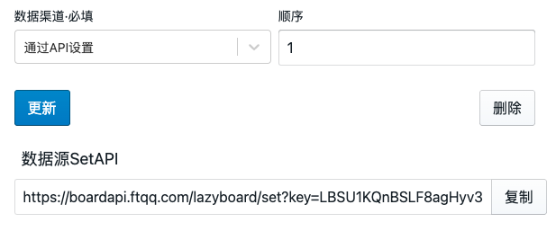
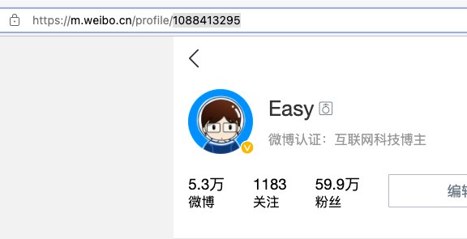
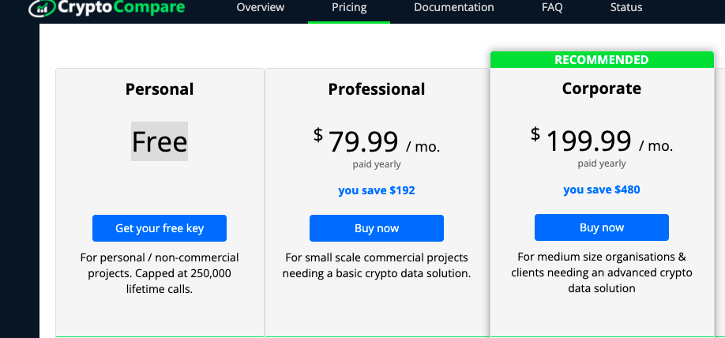
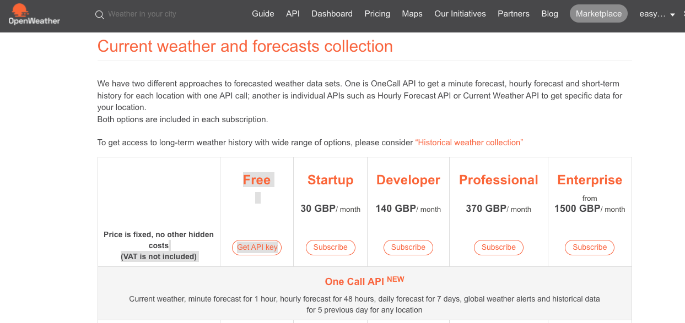
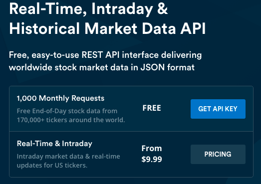
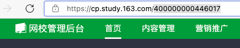

# LazyBoardExt

## 是什么？

⚠️ 虽然 LazyBoardExt 是为 LazyBoard 设计，但它是一个通用工具，只需要将`数据回填URL`设置为你自己的接口地址即可。见下文「使用自己的数据回填地址」

LazyBoardExt 是一个浏览器插件，可以定时采集特定的数据并更新到[LazyBoard](https://board.level06.com/home)上（当然你也可以提交到其他地方），只要开着浏览器，数据就会持续更新。


## 为什么？

浏览器插件除了可以通过API接口读取数据，还能直接共用登入状态读取没有API接口的网站的数据。

## 如何使用？

### 安装插件

#### 从插件代码安装

在项目release中下载代码包，然后在浏览器插件管理中载入「未打包插件」即可使用。

#### 从商店安装

还没有上架

### 添加数据源

安装插件后，在添加数据源选择类别，按提示输入对应的参数即可

### 已有数据源和相关参数

#### 公用参数说明
|参数|说明|备注|图示|
|-|-|-|-|
|数据回填URL|用于回填数据到LazyBoard|在 https://board.level06.com/home 编辑器页面点预览区的数字，复制下方的`数据源SetAPI`原样填入即可|
|抓取时间间隔|设置抓取间隔|单位为分


#### 社交应用

##### 微博粉丝数

⚠️ 此数据无需登入即可获取

|参数|说明|备注|图示|
|-|-|-|-|
|微博UID|要查询的微博用户的UID|m.weibo.cn登入后点左上角小人后URL中的数字（https://m.weibo.cn/profile/就是这个数字）| 

##### B站未读回复数

⚠️ 此数据需要浏览器账号登入

没有额外参数

#### 加密货币

##### BTC/ETH 对 USD 价格

⚠️ 此数据需要申请API Key



|参数|说明|备注|图示|
|-|-|-|-|
|API Key|[到cryptocompare申请免费Key](https://min-api.cryptocompare.com)||
|显示货币的种类|如BTC、ETH|建议大写
|显示货币价格的币种|如USD|建议大写

#### 生活

##### 当前城市天气

⚠️ 此数据需要申请API Key



|参数|说明|备注|图示|
|-|-|-|-|
|API Key|[到openweathermap申请免费Key](https://openweathermap.org/full-price#current)|key刚申请下来时会报错，等10分钟左右才会生效|
|城市拼音|如chongqing|建议全部小写

##### 美股查询

⚠️ 此数据需要申请API Key



|参数|说明|备注|图示|
|-|-|-|-|
|API Key|[到marketstack申请免费Key](https://marketstack.com/)||
|股票代码|如AAPL|建议大写


#### 办公和业务

##### 网易云课堂讲师账户总金额

⚠️ 此数据需要浏览器账号登入

|参数|说明|备注|图示|
|-|-|-|-|
|讲师ID|当前用户的讲师ID|进入网校管理后台后，URL最后的一串数字| 

## 如果添加没有的数据源

### 自定义操作

在数据源分类下拉框中选择`自定义`可以编写代码实现列表中没有的数据源。

自定义操作分类中，除了每个分类都有的 `数据回填URL` 和 `抓取间隔时间` 外；还有两个额外输入框：`数据来源URL` 和 `执行代码·JavaScript`。

在 `执行代码·JavaScript` 中，我们可以通过 data 对象访问其他三个：

1. 数据来源URL - data.customer_fetch_data_url
1. 数据回填URL - data.customer_fetch_source_url
1. 抓取时间间隔 - data.customer_fetch_check_minutes

`执行代码·JavaScript` 的主要任务是请求URL，并将返回值拼接为需要的格式，这里可以采用 `fetch` 接口来实现，以下是一个demo：

```js
let result = await fetch( data.customer_fetch_data_url );
const jsondata = await result.json();
return jsondata.value
```

代码通过return来传递返回值。运行部分的源码如下，可供参考：

```js
async customer_fetch_fetch( data )
{
    let ret = '-';
    eval("ret = (async () => {" + data.customer_fetch_code + "})()");
    return ret;
}
```

### 贡献新的数据源

添加新的数据源很简单，只需要三步。假设我们要添加一个中文说明为「甲乙丙丁」英文唯一标识符为「abcd」的数据源。

#### 在 Source 中添加 fields 属性

首先我们需要在 `src/lib/Source.js` 添加属性来定义输入界面，属性名为 `abcd_args`：

```js
abcd_args = {
    "fields": [
        {
            "field_id":"abcd_source_url", // id
            "field_name":"数据回填URL·在LazyBoard中复制", // 输入框上方的文字说明
            "field_default":"", // 默认值
            "field_type":"text", // text 单行 textarea 多行
        },
        {
            "field_id":"abcd_check_minutes",
            "field_name":"抓取时间间隔·分钟数",
            "field_default":"0",
        },
    ]
};
```
每一个 `field` 通过属性进行定义，已经通过注释标明。注意上边两个字段是每个数据源都必须的。 

#### 在 Source 中添加 fetch 方法

然后定义一个 `abcd_fetch` 的方法，用来获取数据。在这个方法中，可以通过 `data.字段id` 的方式访问到上边输入框输入的内容。

```js
async abcd_fetch( data )
{
    const ret = await axios.get('http://api.marketstack.com/v1/intraday?access_key='+ data.marketstack_key +'&symbols='+data.marketstack_symbol+'&limit=1');
    if( ret?.data )
    {
        return ret.data.data[0].last;
    }
    else
        return "-";

}
```

#### 将数据源添加到菜单

最后我们还需要在 `src/store/AppState.js` 中的 `source_types` 添加一行，让菜单显示新的数据源。

```js
source_types = [
    {"label":"甲乙丙丁","value":"abcd"}, // 这里加一行
    {"label":"微博粉丝数","value":"weibo_fans"},
    {"label":"B站未读回复","value":"bili_unreply"},
    {"label":"加密货币实时价格","value":"coin_price"},
    {"label":"城市天气","value":"open_weather"},
    {"label":"美股查询","value":"marketstack"},
    {"label":"网易云课堂讲师账户总金额","value":"study_163"},
    {"label":"自定义操作","value":"customer_fetch"},
];
```
#### 编译并使用

编写完成后，可以在根目录下运行命令 `yarn build`，完成后通过浏览器载入 `build` 目录作为插件目录即可使用。

## 使用自己的数据回填地址

你也可以使用 LazyBoardExt 来给其他应用采集数据，只需要将「数据回填URL」填写为对应的 URL 即可。注意需要在该URL中添加 `value=new_value` 字段，将会被替换为 `value=采集到的的值`。
以下实现代码可供参考：

```js
const set_url = item[item.field+'_source_url'].replace(/value=.+/ig,'value='+encodeURIComponent(value));
```

